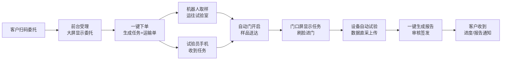

# 浦江网联智慧试验室三期建设方案

> 版本：V0.1（讨论稿） · 2026-10-08
> 编写依据：2026-09-22 浦江三期会议录音（孙晗、黄荣华、周佳佳）；参考《浦江检测智能样品运输项目技术方案 V1.0》
> 定位：**二期 PLUS**——先把二期没跑通的环节收尾，再用最少的硬件把"委托 → 运输 → 试验 → 报告"一条线真正打通，做到领导来了能看、试验员每天能用。

---

## 一、一页纸摘要

| 项目 | 内容 |
| --- | --- |
| 本期唯一目标 | 一份真实委托，从客户扫码下单到报告生成，全程联动、无人工二次录入，领导现场 10 分钟内能完整看一遍 |
| 打通的环节 | ① 委托受理 → ② 机器人运输 → ③ 任务通知与进门 → ④ 设备自动试验与数据直采 → ⑤ 一键生成报告 |
| 前置条件 | 二期收尾：易企接口打通、门口屏数据联动、监控回放可在办公室查看、二期/三期边界书面确认 |
| 新增硬件 | 样品运输机器人 2 台、试验室门改造为自动门、门口信息屏、大厅全流程看板；示范设备 1 台（压力机）先行 |
| 不在本期 | 知识库扩建、模型训练、算力服务器、桥检报告智能编制、龄期提醒、异常预警（闭环跑通后再做，见第七章） |
| 工期 | 约 3–4 个月（其中机器人到货后联调约 1 个月） |
| 预算量级 | 必选硬件约 28–35 万元（机器人、门改造、屏幕）；接口、设备改造、软件联调另行报价；自动化成型线为选配，约 80 万元 |

---

## 二、为什么这样写：会议里定下的方向

前两版方案（《委托检测全流程改造深化建设方案》《设备自动化与报告输出智能化建设方案》）已被否定。会上浦江方意见集中在四点：

1. **要看得见。** "领导去了，要能眼前一亮"；软件再强，"展示不出来，内功再强也没用"。本期必须有实物在动：机器人在跑、设备在自动做、屏幕在联动。
2. **先走路再跑。** "前面的还不会走路，你怎么跑？"知识库、模型、智能分析都是后期升级，本期不作为主体。
3. **三个环节先打通。** 受样（委托）、运输、做实验并生成报告——"你把 1、2、3 给我打通，需要买什么我去买"。
4. **二期要先收尾、先定调。** 智慧平台下不了委托单、门口屏信息是后台手填的、监控不能回放，这些问题不解决，三期无从谈起。

因此本方案的结构是：**二期收尾（第四章）→ 闭环建设（第五章）→ 展示设计（第六章）→ 后续升级（第七章）**。

---

## 三、现状问题清单

| # | 环节 | 现状（会议反馈） | 影响 | 本期处理 |
| --- | --- | --- | --- | --- |
| 1 | 委托 | 智慧平台下不了委托单，委托仍在易企系统办理；易企接口一直未打通 | 平台"什么也干不了"，后面所有联动都没有源头 | 第四章 4.1：按合同落实易企接口，先跑通委托数据 |
| 2 | 门禁/门口屏 | 屏幕上的任务信息是后台手填的，不随委托联动 | 演示时是"假数据"，失去说服力 | 第四章 4.2：改为由委托任务自动驱动 |
| 3 | 运输 | 全部人工搬运；机器人因价格一直未采购；门为推拉门，机器人过不去 | 流程在第二步断开 | 第五章 5.2：采购 2 台机器人 + 门改造 |
| 4 | 设备数据 | 压力机示范改造上次已承诺，至今未做 | 浦江方对"能实现"失去信任 | 第五章 5.4：作为第一个交付物，2 周内完成 |
| 5 | 报告 | 数据采集不了，报告仍需手工编制 | 闭环最后一步缺失 | 第五章 5.5：示范项目一键出报告 |
| 6 | 监控 | 分场所监控平台只能看实时，回放只能去机房硬盘录像机上看；领导要求在办公室看回放 | 领导直接关注的问题，需本月内解决 | 第四章 4.3：先远程直连，再评估平台回放 |
| 7 | 边界 | 哪些属于二期、哪些属于三期一直说不清 | 双方都无法推进 | 第四章 4.4：出一份边界确认单，双方领导签字 |

---

## 四、前置工作：二期收尾（三期启动的前提）

### 4.1 易企委托接口打通

- **目标：** 在智慧平台上能下委托单，或至少能实时拿到易企里的委托、样品、任务数据，作为后续联动的源头。
- **做法：**
  1. 浦江方查出与易企签的补充合同（会上提到约定 1,500 元/接口），确认已约定的接口范围和费用。
  2. 正方（王锦升负责）列出所需接口清单：委托信息、样品信息、检测项目、任务分配、任务状态回写。
  3. 三方开一次对接会，当场确认接口清单、报价、开放时间。
- **兜底方案：** 若易企短期内不开放接口，智慧平台先做"单点跳转"（从平台进入易企下单），同时由新建的扫码委托小程序（5.1）作为三期演示链路的委托源头，不让整条链卡在这一步。
- **完成标志：** 在易企或小程序下一单，智慧平台 1 分钟内能看到这条委托。

### 4.2 门口屏与门禁联动改造

- 门口屏显示内容改为由任务数据自动生成：当前委托编号、样品、检测项目、负责试验员、状态。
- 取消后台手工录入；无任务时显示试验室基本信息。

### 4.3 监控回放

- **本月内：** 在机房电脑上部署远程访问（跳板机或向日葵类工具），领导在办公室电脑即可调看硬盘录像机里的历史录像。
- **后续评估：** 若要求在平台内直接回放，需评估云存储成本（20 余路摄像头 × 90 天录像，数据量大，需单独报价），由浦江方决定是否投入。

### 4.4 二期 / 三期边界确认单

- 正方列出二期合同内每一项的交付状态（已交付 / 部分交付 / 未交付及原因）。
- 列出本方案中每一项属于"二期收尾"还是"三期新增"。
- 由陈总与正方负责人共同确认签字，作为后续推进和验收的唯一依据。

---

## 五、闭环建设内容

### 5.0 一条完整的业务链

每一步都由上一步自动触发，人只做核对和确认，不做重复录入。

### 5.1 环节一：智能委托受理

| 内容 | 说明 |
| --- | --- |
| 扫码委托小程序 | 前台放置二维码，客户手机扫码填写委托；常用单位、工程、联系人信息自动带出，再次委托基本免填 |
| 前台受理 | 收样员在平台上核对样品与委托信息，确认后点"受理" |
| 大厅受理屏 | 受理成功后屏幕显示：委托编号、客户、检测项目、预计出报告日期 |
| 客户回执 | 小程序/短信推送受理成功、预计周期、后续进度 |
| 一键下单 | 受理即自动生成：检测任务（派给试验员）+ 运输任务（派给机器人） |

### 5.2 环节二：样品智能运输

| 内容 | 说明 |
| --- | --- |
| 机器人数量 | **2 台**（浦江方明确要求，一台无法形成展示效果）；单台约 10 万元 |
| 机型建议 | 参考搬运技术方案：一台选"升降带屏幕"型（行进中屏幕显示所载样品与目的地，展示效果好），一台选潜伏顶升型（承载混凝土试块等重样品）；最终按样品重量、通道宽度现场勘查后定 |
| 首条路线 | 收样室 → 示范试验室（力学室），同楼层固定路线先跑通，再扩展 |
| 门改造 | 路线上的推拉门改为感应自动门（或加装电动开门机），与机器人调度系统联动；约 5,000 元/扇 |
| 交接 | 收样员扫码装载 → 机器人出发 → 到达后语音播报并推送试验员 → 试验员扫码确认接收 |
| 异常 | 通道阻塞、无人接收、低电量时自动暂停并通知，转人工处理 |
| 场地条件 | 地面平整、坡度 ≤5%、门槛 ≤5 mm、无线信号 ≥ -65 dBm（按搬运方案要求，进场前勘查确认） |

### 5.3 环节三：任务通知与进门

- 试验员手机（企业微信或 APP）第一时间收到任务：样品、检测项目、所在试验室、样品预计到达时间。
- 试验室门口屏自动显示该任务；试验员刷脸进门，门禁记录与任务关联。
- 进门后语音播报当前任务与注意事项（检测依据、样品数量）。

### 5.4 环节四：设备自动试验与数据直采

| 阶段 | 内容 | 时间 |
| --- | --- | --- |
| 第一步：示范 | 改造 1 台压力机，试验数据自动上传智慧平台并关联任务。上次会议已承诺，作为三期第一个可见交付物 | 启动后 2 周内 |
| 第二步：高频设备 | 梳理全部仪器清单，按使用频率排序，先接入最常用的 3 类设备 | 示范完成后分批 |
| 选配：自动化成型线 | 苏交科自动拌料—成型—脱模线，代理价约 80 万元（对外报价约 120 万元）。展示效果强，但属研发型设备、故障率偏高，建议先实地考察、谈好维保再定 | 由浦江方决策 |

数据直采要求：不改变试验员原有操作方式；数据带时间、设备编号、操作人自动关联任务；无法匹配任务的数据进入"待确认"，不自动归档。

### 5.5 环节五：一键生成报告

- 示范项目：**混凝土抗压强度**（对应示范压力机），使用浦江现行报告模板。
- 试验结束后，平台自动计算、填入模板，生成报告初稿；试验员核对 → 审核 → 签发，沿用现有审批流程。
- 报告签发后自动推送客户（小程序可查看、下载）。
- 跑通一类报告后，其他报告按同样方式复制。

---

## 六、展示设计

本期所有建设内容最终都要能在下面这条演示路线中被看到。

**领导参观演示脚本（约 10 分钟）：**

| 步骤 | 地点 | 领导看到什么 |
| --- | --- | --- |
| 1 | 大厅 | 工作人员扮演客户扫码委托；受理屏实时弹出新委托 |
| 2 | 收样室 | 收样员一键受理；机器人屏幕亮起，载样出发 |
| 3 | 走廊 | 机器人自动行进，自动门开启 |
| 4 | 大厅看板 | 全流程看板显示：样品当前位置、机器人状态、试验员已接单 |
| 5 | 力学室门口 | 门口屏显示该任务，试验员刷脸进门 |
| 6 | 力学室 | 试样放上压力机，自动加载；数据实时显示在看板上 |
| 7 | 大厅看板 | 试验结束，报告自动生成并展示 |

**全流程看板（大厅大屏）：** 今日委托数、在途样品、机器人位置与电量、设备运行状态、待出报告数、单个委托的实时进度（类似快递轨迹）。

**说明：** 演示走的是真实委托、真实数据，平时就是试验员的日常工作流程，不是专门为演示搭的假场景。

---

## 七、后续升级（不在本期范围）

以下内容有价值，但须在闭环跑通、日常稳定使用之后再做，届时另行立项：

| 方向 | 内容 |
| --- | --- |
| 知识库建设 | 标准规范、试验方法、质量体系、报告模板、项目案例的整理入库，提升"小普"能力 |
| 龄期提醒 | 根据成型日期自动提醒混凝土试块到龄期 |
| 异常预警 | 数据、设备、环境、进度、检测结果的异常自动预警与留痕 |
| 桥检报告 | 将已采购的桥检报告软件集成进平台 |
| 设备全面接入 | 剩余仪器分批接入，提高数据直采覆盖率 |
| 驻场实施 | 前沿部署工程师（FDE）驻场，配合业务流程 AI 化改造 |

---

## 八、实施计划

| 阶段 | 周期 | 主要工作 | 可见成果 |
| --- | --- | --- | --- |
| 0. 二期收尾 | 第 1–4 周 | 易企接口对接会、门口屏联动、监控远程回放、边界确认单 | 平台能看到真实委托；领导办公室能看回放 |
| 1. 示范设备 | 第 1–2 周（并行） | 压力机数据直采改造 | 压力机数据自动上平台 |
| 2. 采购与勘查 | 第 2–6 周 | 机器人选型与采购审批、路线勘查、门改造、屏幕安装、扫码委托小程序开发 | 硬件到场 |
| 3. 联调 | 机器人到货后约 4 周 | 委托 → 运输 → 通知 → 试验 → 报告全链路联调 | 一单真实委托完整跑通 |
| 4. 试运行与彩排 | 2–4 周 | 日常业务试运行、演示彩排、问题修正 | 连续稳定运行，可接待参观 |

---

## 九、预算估算

以下为会议中提到的参考价，最终以询价和合同为准。

| 项目 | 数量 | 参考单价 | 小计 | 性质 |
| --- | --- | --- | --- | --- |
| 样品运输机器人（含调度系统、充电桩） | 2 台 | 约 10 万元 | 约 20 万元 | 必选 |
| 试验室门改造（自动门/开门机） | 按路线确认，约 6–10 扇 | 约 0.5 万元 | 约 3–5 万元 | 必选 |
| 门口信息屏、大厅看板大屏 | 待勘查 | 待询价 | 约 5–10 万元 | 必选 |
| 易企接口 | 按接口清单 | 1,500 元/接口（合同约定，待核实） | 待定 | 必选 |
| 压力机等设备数据采集改造 | 首台 + 高频设备 | 待询价 | 待定 | 必选 |
| 软件开发与联调（小程序、看板、联动、报告模板） | — | — | 正方另行报价 | 必选 |
| 自动化成型线 | 1 套 | 代理价约 80 万元 | 约 80 万元 | 选配 |

---

## 十、分工与配合

| 角色 | 负责事项 |
| --- | --- |
| 浦江 · 孙晗 | 总体协调；向陈总汇报并申请采购审批；组织内部配合 |
| 浦江 · 李涛 | 示范设备（压力机）对接 |
| 浦江 · 技术部 | 提供委托表单、检测参数、报告模板；参与测试 |
| 浦江 · 周佳佳 | 监控回放需求确认与验收 |
| 正方 · 黄荣华 | 方案总负责；软件联调与交付 |
| 正方 · 王锦升 | 易企接口对接；监控回放落地 |
| 易企 | 开放委托相关接口 |
| 机器人供应商 | 设备供货、路线部署、与平台对接 |

---

## 十一、验收标准

1. 用真实样品连续 3 次完整跑通演示脚本全部 7 步，中途无需人工补录数据。
2. 委托受理后，试验员 1 分钟内收到任务通知；门口屏同步显示。
3. 机器人在首条路线上的送达成功率 ≥ 95%（试运行期统计）。
4. 示范压力机试验数据 100% 自动上传并关联到正确任务。
5. 示范项目报告由系统自动生成初稿，试验员仅需核对与签字。
6. 领导可在办公室电脑调看分场所监控历史录像。

---

## 十二、待决策事项

| # | 事项 | 决策人 |
| --- | --- | --- |
| 1 | 机器人 2 台采购预算审批 | 陈总 |
| 2 | 二期 / 三期边界确认单签字 | 陈总、正方负责人 |
| 3 | 易企接口范围、费用、开放时间 | 浦江、易企、正方三方 |
| 4 | 首条运输路线与示范试验室（是否跨楼层） | 孙晗 |
| 5 | 是否采购自动化成型线 | 陈总 |
| 6 | 监控是否需要平台内回放（涉及云存储费用） | 浦江方 |
