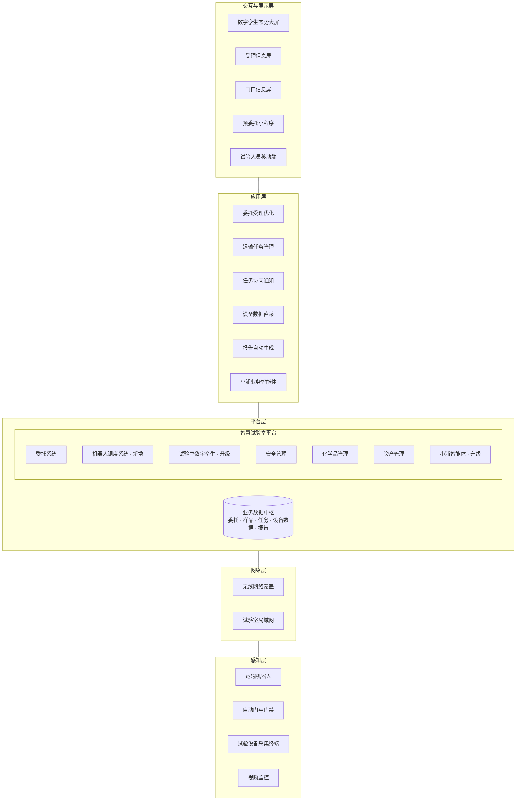
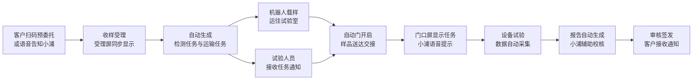

# 浦江网联智慧试验室三期建设方案

**——面向检测业务全流程闭环的软硬件协同与智能体赋能建设研究**

> 版本：V0.3（讨论稿）
> 编制日期：2026 年 10 月
> 建设单位：浦江检测
> 实施单位：江苏正方交通科技有限公司

---

## 摘要

检测试验室的数字化建设，正在从单一业务系统的信息化，转向覆盖"委托受理—样品流转—试验执行—数据采集—报告生成"全过程的业务闭环。浦江网联智慧试验室一期、二期已建成智慧试验室平台，包含试验室数字孪生、委托系统、安全管理、化学品管理、资产管理等功能模块，并上线了智能问答助手"小浦"，为数字化转型奠定了基础。但各环节之间尚未形成实物流与信息流的同步联动，平台业务数据积累不足，智能体能力难以在日常作业中充分发挥。

本方案以"二期能力完善、三期闭环贯通、智能体全程赋能"为总体思路，提出以业务闭环为主线、软硬件协同为手段、智能体为交互入口、可视化为呈现载体的三期建设路径。方案在不改变委托业务主体的前提下优化委托受理流程；引入自主移动机器人（AMR）实现样品自动运输，并配套门体自动化改造；以压力机为示范开展设备数据直采，实现示范检测项目报告的自动生成；将试验室数字孪生由静态展示升级为业务态势的实时呈现；依托闭环运行产生的实时业务数据，将"小浦"由知识问答助手升级为贯穿委托、运输、试验、报告各环节的业务智能体。

方案同时对运输机器人的技术路线进行比选，给出选型建议，并将知识库体系化建设、专项报告智能编制等能力列为后续演进方向，形成分阶段、可验证、可扩展的建设框架。

**关键词：** 智慧试验室；业务闭环；自主移动机器人；设备数据直采；智能体；数字孪生

---

## 第一章 背景

### 1.1 建设背景

浦江网联智慧试验室自一期建设以来，围绕试验室信息化与智能化持续投入，建成了智慧试验室平台，涵盖试验室数字孪生、委托系统、安全管理、化学品管理、资产管理等功能模块，部署了门禁与门口信息屏、分场所视频监控，并上线了智能问答助手"小浦"，为试验室数字化转型奠定了基础。

随着建设的深入，试验室对数字化成果提出了更高要求：一方面，平台需要切实承载日常检测业务，使委托、样品、任务、数据与报告在同一条业务链上连续流转；另一方面，建设成果需要以直观、可感知的方式呈现，既服务于内部管理，也服务于上级单位考察与客户参观。三期建设即在此背景下开展。

### 1.2 行业发展趋势

当前，工程检测领域的智慧试验室建设呈现以下趋势：

1. **由系统建设向流程贯通转变。** 建设重点从部署独立的信息系统，转向打通委托、样品、试验、报告各环节，实现数据"一次采集、全程复用"。
2. **由信息化向软硬件协同转变。** 自主移动机器人、自动门禁、物联网采集终端等硬件设施与业务平台深度联动，实物流与信息流同步运行。
3. **由结果管理向过程留痕转变。** 依据检验检测机构资质认定相关要求，试验过程数据、原始记录与报告之间须建立可追溯关系，自动采集是保障数据真实性的重要手段。
4. **由功能操作向智能体交互转变。** 以大语言模型为核心的业务智能体，正在成为业务系统的统一交互入口；其效能取决于能否获取真实、实时、结构化的业务数据。

### 1.3 建设必要性

1. **业务闭环的需要。** 现阶段委托受理、样品运输、试验执行与报告编制仍以人工衔接为主，信息在环节之间需重复录入，影响效率与数据一致性。
2. **成果呈现的需要。** 已建成果多体现为软件能力，缺少可直观感知的实物载体与动态呈现，不利于建设成效的展示与评价。
3. **数据质量的需要。** 试验数据人工抄录存在差错风险，通过设备数据直采可提升原始数据的真实性、完整性与可追溯性。
4. **智能体效能释放的需要。** "小浦"已具备语音及文字交互能力，但缺少业务数据支撑，应用场景局限于通用问答。业务闭环运行后形成的实时数据，是智能体发挥业务价值的基础。

### 1.4 编制依据

- GB/T 27025—2019《检测和校准实验室能力的通用要求》
- RB/T 214—2017《检验检测机构资质认定能力评价 检验检测机构通用要求》
- GB/T 20721—2006《自动导引车 通用技术条件》
- 浦江网联智慧试验室一期、二期建设方案及交付资料
- 《浦江检测智能样品运输项目技术方案 V1.0》（2026 年 1 月）
- 浦江网联智慧试验室三期建设需求沟通会议纪要（2026 年 9 月 22 日）

---

## 第二章 现状分析与需求研判

### 2.1 已建成果

| 模块 | 已具备能力 | 三期定位 |
| --- | --- | --- |
| 试验室数字孪生 | 试验室全景与楼层三维孪生概览 | 由静态展示升级为业务态势实时呈现 |
| 委托系统 | 委托登记至报告打印的业务办理 | 委托业务主体保持不变，开展受理流程优化与环节联动 |
| 安全管理 | 安全监控与预警管理，分场所视频实时查看 | 完善历史录像远程调阅，纳入机器人运行区域监控 |
| 化学品管理 | 化学品库存、领用与试剂柜管理 | 保持运行，纳入"小浦"业务查询范围 |
| 资产管理 | 设备管理与数据管理 | 承接设备数据直采，设备台账与采集数据、运行状态关联 |
| 门禁与门口信息屏 | 人员进出管理、试验室信息展示 | 改造为由任务数据驱动的动态信息屏 |
| 智能问答助手"小浦" | 语音及文字交互、检测知识问答 | 升级为贯穿业务各环节的业务智能体 |

### 2.2 现存问题分析

| 环节 | 现状 | 存在问题 |
| --- | --- | --- |
| 委托受理 | 委托信息以纸质填写或现场录入为主 | 客户操作繁琐；受理结果缺少可视化呈现与进度反馈；受理后未自动触发后续环节 |
| 样品流转 | 样品在收样室、各试验室之间依靠人工搬运 | 运输过程无记录、无状态，样品位置不可查询；试验室现有推拉门不具备自动通行条件 |
| 任务协同 | 门口信息屏内容需人工维护 | 屏幕信息与实际任务不同步，未体现联动效果 |
| 试验执行 | 试验数据以人工读取、抄录为主 | 数据录入工作量大，存在转录差错风险 |
| 报告编制 | 报告以人工编制为主 | 报告编制耗时长，数据一致性依赖人工校核 |
| 安全管理 | 平台端仅支持实时查看，历史录像需在机房调阅 | 管理人员远程调阅历史录像不便 |
| 数字孪生 | 以静态三维模型展示为主 | 未接入实时业务数据，难以反映试验室运行状态 |
| 智能体 | "小浦"以通用知识问答为主 | 未接入业务数据，无法回答业务问题、辅助业务操作 |

### 2.3 需求研判

综合上述分析，三期建设的核心需求可归纳为"**贯通、可见、可用**"三个方面：

- **贯通：** 打通委托受理、样品运输、试验执行与数据采集、报告生成各环节，形成完整业务闭环；
- **可见：** 建设成果具备直观的实物载体与动态呈现，业务运行过程可被现场观察；
- **可用：** 所建能力服务于试验人员的日常作业，并通过智能体降低系统使用门槛。

三者之间存在递进关系：业务贯通产生实时数据，实时数据驱动可视化呈现与智能体应用，智能体又进一步降低业务操作成本，形成良性循环。

---

## 第三章 总体设计

### 3.1 设计原则

1. **闭环优先。** 优先打通业务主链路，高阶智能化能力在闭环稳定运行后逐步叠加。
2. **继承发展。** 充分复用已建平台模块，委托业务主体保持不变，避免重复建设。
3. **软硬协同。** 平台与机器人、门禁、采集终端等硬件统一调度、同步联动。
4. **数据驱动。** 以闭环运行产生的实时业务数据，驱动数字孪生呈现与智能体应用。
5. **示范先行。** 选取一条运输路线、一台试验设备、一类检测报告开展示范，验证后再推广复制。
6. **过程留痕。** 委托、运输、交接、试验、报告各环节操作均自动记录，满足质量管理与追溯要求。

### 3.2 建设目标

**总体目标：** 构建"委托受理—样品运输—任务协同—试验采集—报告生成"全流程闭环，实现一份真实委托从受理到报告生成全程联动、数据自动流转；以"小浦"智能体作为各环节的统一交互入口，以数字孪生实时呈现业务态势。

**具体目标：**

| 序号 | 目标 | 量化指标 |
| --- | --- | --- |
| 1 | 委托受理流程优化 | 客户扫码完成预委托；受理后自动生成检测任务与运输任务 |
| 2 | 样品自动运输 | 首条示范路线投入运行，送达成功率不低于 95% |
| 3 | 任务实时协同 | 受理后 1 分钟内试验人员收到任务通知，门口信息屏同步更新 |
| 4 | 设备数据直采 | 示范设备试验数据 100% 自动采集并关联对应任务 |
| 5 | 报告自动生成 | 示范检测项目报告由系统自动生成，试验人员仅需核对确认 |
| 6 | 业务态势呈现 | 数字孪生实时呈现委托、样品、机器人、设备、报告状态 |
| 7 | 智能体业务化 | "小浦"可回答委托进度、任务、设备、报告等业务查询，并支持语音预委托与报告辅助校核 |

### 3.3 总体架构

总体架构按"感知层—网络层—平台层—应用层—交互与展示层"组织。平台层以智慧试验室平台为核心，在已建模块基础上新增机器人调度系统，升级数字孪生与"小浦"智能体，并建设统一业务数据中枢。

**业务数据中枢**汇聚委托、样品、运输、任务、设备采集数据与报告等业务数据，以委托编号、样品编号、设备编号为主键建立关联，统一向数字孪生、"小浦"智能体及各应用提供数据服务。

### 3.4 业务闭环模型

各环节由上一环节自动触发，人员职责聚焦于核验、确认与审核；"小浦"在各环节提供语音交互、信息查询与辅助判断。

---

## 第四章 建设内容

### 4.1 二期能力完善

三期建设以二期能力完善为前提，主要包括：

1. **委托数据联动。** 建立委托系统与业务数据中枢之间的数据同步机制，使委托、样品、检测项目、任务状态等信息可被各应用实时获取，作为后续各环节联动的数据源头。
2. **门口信息屏动态化。** 门口信息屏显示内容由任务数据自动生成，包括委托编号、样品名称、检测项目、责任试验人员与任务状态，取消人工维护。
3. **建设范围确认。** 对二期交付状态与三期建设内容进行逐项梳理，形成建设范围确认单，作为后续实施与验收依据。

### 4.2 委托受理流程优化

委托业务主体保持不变，三期围绕"减少客户操作、受理结果可见、后续环节自动触发"进行流程优化：

| 优化环节 | 建设内容 |
| --- | --- |
| 预委托 | 建设扫码预委托小程序，客户扫码填报委托信息；常用单位、工程、联系人信息自动带出，减少重复填写；支持通过"小浦"语音描述或拍摄纸质委托单，自动识别并预填委托信息 |
| 受理 | 收样人员核验样品与预委托信息，确认后在委托系统完成正式受理 |
| 受理呈现 | 受理信息屏实时显示受理结果：委托编号、委托单位、检测项目、预计出具报告日期 |
| 任务派发 | 受理完成后自动生成检测任务与样品运输任务，分别推送至试验人员与机器人调度系统 |
| 进度反馈 | 通过小程序或短信向客户推送受理确认、检测进度与报告出具通知；客户可在小程序内向"小浦"查询委托进度 |

**前端原型：** 在方案评审阶段同步交付委托受理流程的前端交互原型，用于流程确认与现场演示，确认后进入正式开发。

### 4.3 样品智能运输系统

1. **运输机器人。** 配置运输机器人 2 台，具体选型见第五章。
2. **调度系统。** 部署机器人调度系统，作为智慧试验室平台新增模块，接收运输任务，完成路径规划、任务分配、交通管理与自动充电管理。
3. **门体自动化改造。** 对运输路线上的推拉门实施自动门改造或加装电动开门机，门体具备开门、关门及开门到位信号输出，与调度系统联动实现机器人自主通行。
4. **交接管理。** 样品装载时扫码绑定委托与样品编号；机器人到达后语音播报并推送接收人员，接收人员扫码确认，交出、运输、接收记录分别留存。
5. **异常处置。** 通道阻塞、无人接收、定位异常、低电量等情况下自动暂停并告警，必要时转人工处理。
6. **示范路线。** 首条示范路线设定为收样室至力学试验室（同楼层），运行稳定后逐步扩展至其他试验室。

### 4.4 任务协同与智能门禁

1. 受理完成后，试验人员通过移动端第一时间接收任务信息，包括样品、检测项目、所在试验室与样品预计送达时间。
2. 门口信息屏同步显示该试验室当前任务；试验人员经身份核验进入试验室，门禁记录与任务自动关联。
3. 试验人员进入试验室后，"小浦"以语音方式提示当前任务、检测依据与样品数量；试验人员可随时语音询问任务详情与操作要点。

### 4.5 设备数据直采

数据直采按"示范—推广"两阶段实施，采集数据统一纳入资产管理模块，与设备台账关联：

| 阶段 | 建设内容 |
| --- | --- |
| 示范阶段 | 选取压力机作为示范设备，完成数据采集改造；试验数据自动上传，并与委托、样品、任务、操作人员自动关联 |
| 推广阶段 | 编制试验室仪器设备清单，按使用频率与数据输出条件分类，优先完成高频设备接入，逐步提高数据直采覆盖率 |

**技术要求：** 不改变试验人员原有设备操作方式；采集数据包含原始值、试验曲线、采集时间与设备编号；无法匹配任务的数据进入待确认状态，由试验人员处理，不自动归档；对漏采、重复采集、单位不一致等情况进行提示与留痕；设备运行状态与使用记录同步更新至资产管理模块。

### 4.6 报告自动生成

1. **示范项目。** 以混凝土抗压强度检测作为示范项目，与示范设备相对应。
2. **生成机制。** 试验完成后，系统依据采集数据与计算规则自动完成计算，按现行报告模板生成报告初稿。
3. **智能辅助校核。** "小浦"对报告初稿进行辅助校核，包括采集数据与报告数据一致性比对、计算结果复核、检测结果与标准限值的符合性提示，校核意见供试验人员参考。
4. **审核签发。** 报告初稿经试验人员核对、审核人员审核后签发，沿用现行审批流程。
5. **成果交付。** 报告签发后自动推送客户，客户可通过小程序查看与下载。
6. **复制推广。** 示范项目验证完成后，按同一机制扩展至其他检测项目。

### 4.7 安全管理完善

1. **历史录像远程调阅。** 通过远程访问方式，实现管理人员在办公终端调阅硬盘录像机中的分场所历史录像；平台内回放功能结合存储资源需求另行评估。
2. **机器人运行区域监控。** 将机器人运行路线纳入视频监控范围，运输异常时可联动调取对应位置画面。

### 4.8 数字孪生业务态势升级

在现有试验室三维孪生模型基础上，接入业务数据中枢的实时数据，由静态展示升级为业务态势呈现：

| 呈现内容 | 说明 |
| --- | --- |
| 机器人实时轨迹 | 在楼层模型中实时显示运输机器人位置、行进路线、任务与电量 |
| 样品流转追踪 | 选中委托后，在模型中显示样品当前所在位置与流转路径 |
| 设备运行状态 | 试验设备以状态色标识空闲、试验中、故障；点选可查看实时试验数据 |
| 试验室任务态势 | 各试验室当前任务数量与人员在岗情况 |
| 安全告警联动 | 安全告警、运输异常在模型中定位显示，并联动视频画面 |
| 业务统计 | 当日委托数量、在检样品数量、待出报告数量等统计指标 |

数字孪生大屏同时作为"小浦"的语音交互终端，管理人员可语音查询业务数据，查询结果在模型中同步定位呈现。

### 4.9 "小浦"业务智能体升级

#### 4.9.1 升级思路

"小浦"现阶段以通用知识问答为主，主要原因在于缺少可用的业务数据。三期业务闭环运行后，委托、样品、运输、任务、设备数据、报告等实时数据统一汇聚于业务数据中枢，为智能体提供了数据基础。本期通过为"小浦"接入业务数据查询能力与业务操作能力，使其由知识问答助手升级为贯穿业务各环节的业务智能体。

#### 4.9.2 应用场景

| 业务环节 | 应用场景 | 服务对象 |
| --- | --- | --- |
| 委托受理 | 语音描述或拍照识别委托单，自动预填委托信息 | 客户、收样人员 |
| 进度查询 | 查询委托受理状态、检测进度、预计出报告时间 | 客户、内部人员 |
| 样品运输 | 查询样品当前位置与运输状态；语音发起运输任务 | 收样人员、试验人员 |
| 试验执行 | 进门后语音提示当前任务、检测依据与样品数量；语音查询操作要点 | 试验人员 |
| 报告编制 | 报告初稿辅助校核，提示数据不一致与结果不符合项 | 试验人员、审核人员 |
| 管理决策 | 语音查询当日委托、在检样品、设备状态、报告出具等统计数据，结果在数字孪生大屏联动呈现 | 管理人员 |
| 迎宾导览 | 搭载于升降带屏幕式机器人，按预设路线引导来访人员参观并进行讲解 | 来访人员 |

#### 4.9.3 实现方式

1. **业务数据接入。** 通过业务数据中枢为"小浦"提供结构化业务数据查询接口，查询范围按用户角色进行权限控制。
2. **业务工具封装。** 将预委托填报、运输任务发起、报告校核等业务操作封装为智能体可调用的工具，关键操作须经人员确认后执行。
3. **基础资料补充。** 补充示范检测项目相关的检测标准、报告模板与计算规则，作为报告辅助校核的依据。
4. **多终端部署。** "小浦"统一部署于预委托小程序、试验人员移动端、试验室门口终端、数字孪生大屏与迎宾机器人。

---

## 第五章 运输机器人选型研究

### 5.1 选型依据

运输机器人选型须综合考虑以下因素：

| 选型因素 | 考虑要点 |
| --- | --- |
| 样品特性 | 样品类型、单件重量、单批数量、包装方式（如混凝土试块、钢筋、土样、沥青混合料等） |
| 场地条件 | 通道宽度、转弯半径、地面平整度、坡度、门槛高度、是否跨楼层 |
| 交接方式 | 人工装卸、料箱插取或整体顶升 |
| 交互能力 | 是否需要屏幕显示、语音播报、智能体搭载等人机交互功能 |
| 联动能力 | 与自动门、门禁、电梯、智慧试验室平台的对接能力 |
| 展示效果 | 运行过程的直观性与现场观感 |

### 5.2 技术路线比选

| 方案 | 机型类别 | 工作方式 | 额定载荷 | 优势 | 局限 | 适用样品 |
| --- | --- | --- | --- | --- | --- | --- |
| 方案一 | 潜伏顶升式 | 潜入货架或托盘底部顶升后整体运输 | 400 kg 至 1 t 以上（多档可选） | 载荷大，可整架批量运输，技术成熟 | 需配套专用货架，装卸依赖人工 | 混凝土试块、钢筋等重样品批量运输 |
| 方案二 | 潜伏插取式 | 伸缩臂从货架插取料箱后运输 | 中等 | 可自动取放料箱，减少人工装卸 | 需标准化货架与料箱，部署要求较高 | 标准料箱包装的中小样品 |
| 方案三 | 牵引式 | 自动挂钩牵引带轮料车运输 | 较大 | 可利用带轮料车，改造量小 | 转弯半径大，对通道宽度要求高 | 通道宽敞、样品量大的场景 |
| 方案四 | 升降带屏幕式 | 自带升降料仓与交互屏幕 | 较小（约 40～50 kg 级） | 具备屏幕显示与语音交互，可搭载"小浦"，展示效果好，适合人机混行 | 载荷有限，不适合重样品批量运输 | 轻小样品、单件样品运输及迎宾导览 |

> 【参考图 5-1：潜伏顶升式运输机器人（待补充）】
>
> 【参考图 5-2：潜伏插取式运输机器人（待补充）】
>
> 【参考图 5-3：牵引式运输机器人（待补充）】
>
> 【参考图 5-4：升降带屏幕式运输机器人（待补充）】

### 5.3 选型建议

综合样品特性、场地条件与展示需求，建议采用"**一重一轻、功能互补**"的配置方式：

| 配置 | 数量 | 承担任务 |
| --- | --- | --- |
| 潜伏顶升式机器人（方案一） | 1 台 | 承担混凝土试块、钢筋等重样品的批量运输，配套带轮货架或托盘 |
| 升降带屏幕式机器人（方案四） | 1 台 | 承担轻小样品运输；运行中屏幕显示所载样品与目的地；空闲时搭载"小浦"承担迎宾导览与讲解 |

两台机器人由同一调度系统统一管理。最终机型与载荷参数在现场勘查、样品统计完成后确定。

### 5.4 门体通行方案

| 方案 | 方式 | 特点 |
| --- | --- | --- |
| 方案一 | 语音提示、人工开门 | 机器人到达门口后语音播报"样品送达"，由人员开门；改造成本低，自动化程度有限 |
| 方案二 | 电动开门机 / 自动门 | 门体感应机器人或接收调度指令后自动开启；全程无人干预，联动效果完整 |

建议示范路线采用方案二；门体须具备开门、关门及开门到位信号输出，并提供 AC 220 V 或 DC 12 V 电源。

> 【参考图 5-5：自动门联动示意（待补充）】

### 5.5 场地与环境要求

依据 GB/T 20721—2006 及供应商技术要求，机器人运行场地须满足：

| 项目 | 要求 |
| --- | --- |
| 地面起伏 | 1 m² 范围内不大于 3 mm，地面整洁、防滑 |
| 路面坡度 | 不大于 5%；精确停车点不大于 1% |
| 台阶高度 | 不大于 5 mm，停车位置不得有台阶 |
| 沟槽宽度 | 不大于 8 mm，停车位置不得有沟槽 |
| 环境条件 | 温度 0～45 ℃，湿度 15%～95%（无结露），无粉尘及腐蚀性气体 |
| 无线网络 | 运行区域信号强度不低于 -65 dBm，采用 1、6、11 信道 |
| 充电桩 | 单回路功率不低于 2000 W，独立配置 16 A 空气开关 |

---

## 第六章 示范场景设计

三期建设成果通过以下示范场景集中呈现。该场景基于真实委托与真实数据运行，与试验人员日常作业流程一致。

| 步骤 | 场景位置 | 业务动作 | 呈现效果 |
| --- | --- | --- | --- |
| 0 | 大厅 | 来访人员到达 | 迎宾机器人搭载"小浦"引导参观，介绍试验室概况 |
| 1 | 大厅 | 客户扫码或向"小浦"语音描述完成预委托 | 受理信息屏实时显示新委托 |
| 2 | 收样室 | 收样人员核验并受理，样品装载 | 机器人屏幕显示所载样品与目的地，自动出发 |
| 3 | 运输通道 | 机器人自主行进 | 自动门感应开启，机器人自主通行 |
| 4 | 数字孪生大屏 | 任务同步派发 | 三维模型中实时显示机器人轨迹、样品位置与试验人员接单情况 |
| 5 | 试验室门口 | 试验人员接收样品并进门 | 门口信息屏显示当前任务，"小浦"语音提示检测项目与依据 |
| 6 | 力学试验室 | 压力机开展试验 | 试验数据实时采集，设备在孪生模型中显示"试验中"状态 |
| 7 | 数字孪生大屏 | 试验完成 | 报告自动生成，"小浦"完成辅助校核并提示结果 |
| 8 | 数字孪生大屏 | 管理人员语音询问"今日委托情况" | "小浦"语音回答，统计数据在大屏同步呈现 |

---

## 第七章 实施计划

| 阶段 | 周期 | 主要工作 | 阶段成果 |
| --- | --- | --- | --- |
| 第一阶段：能力完善 | 第 1～4 周 | 委托数据联动、门口信息屏动态化、历史录像远程调阅、建设范围确认 | 二期能力完善，平台可获取真实委托数据 |
| 第二阶段：示范采集 | 第 1～2 周（并行） | 压力机数据采集改造与联调 | 示范设备数据自动上传 |
| 第三阶段：设计与采购 | 第 2～6 周 | 现场勘查、机器人选型与采购、门体改造、信息屏安装、委托前端原型评审与开发 | 硬件到场，原型确认 |
| 第四阶段：系统联调 | 硬件到场后约 4 周 | 委托、运输、通知、试验、报告全链路联调；数字孪生数据接入 | 示范场景完整贯通 |
| 第五阶段：智能体升级 | 与第四阶段并行 | "小浦"业务数据接入、业务工具封装、多终端部署 | "小浦"支持业务查询与辅助操作 |
| 第六阶段：试运行 | 2～4 周 | 日常业务试运行、问题整改、示范场景演练 | 系统稳定运行，具备验收条件 |

整体建设周期约 3～4 个月。

---

## 第八章 投资估算

以下为初步估算，最终以询价及合同为准。

| 序号 | 项目 | 数量 | 估算金额（万元） | 备注 |
| --- | --- | --- | --- | --- |
| 1 | 运输机器人（含调度系统、充电桩、货架） | 2 台 | 约 20 | 按第五章选型建议 |
| 2 | 门体自动化改造 | 按示范路线确认（预计 6～10 扇） | 约 3～5 | |
| 3 | 门口信息屏、受理信息屏、门口语音交互终端 | 按现场勘查确认 | 约 5～10 | |
| 4 | 设备数据采集改造 | 示范设备 1 台及后续高频设备 | 待询价 | |
| 5 | 软件开发与系统联调 | — | 另行报价 | 含预委托小程序、前端原型、联动功能、数字孪生升级、"小浦"智能体升级、报告模板 |

---

## 第九章 组织保障与风险控制

### 9.1 组织保障

| 角色 | 主要职责 |
| --- | --- |
| 建设单位（浦江检测） | 建设需求确认、内部协调、采购审批、示范场地与人员配合、提供委托表单与报告模板 |
| 实施单位（江苏正方） | 方案设计、软件开发、系统联调、硬件集成、智能体升级、培训与运维 |
| 委托系统服务方 | 配合委托数据同步 |
| 机器人供应商 | 设备供货、现场部署、调度系统与智慧试验室平台对接 |

### 9.2 风险识别与应对

| 风险 | 影响 | 应对措施 |
| --- | --- | --- |
| 委托数据同步受限 | 影响后续环节联动 | 以预委托小程序作为联动数据源，保障示范链路可运行 |
| 场地条件不满足机器人运行要求 | 影响运输稳定性 | 进场前完成勘查，必要时进行地面、门槛、无线网络整改 |
| 设备数据接口不开放 | 影响数据直采 | 采用文件读取、信号采集等替代方式，或调整示范设备 |
| 人机混行安全 | 存在碰撞风险 | 机器人配置激光避障、安全触边、急停按钮与声光警示 |
| 智能体输出不准确 | 影响业务判断 | 智能体仅提供查询与辅助建议，关键操作须人员确认；校核意见不替代人工审核 |

---

## 第十章 预期成效与验收指标

### 10.1 预期成效

1. **业务效率提升。** 减少委托信息重复录入、样品人工搬运与试验数据人工抄录，缩短委托至报告的周期。
2. **数据质量提升。** 试验数据自动采集、自动关联，降低转录差错，增强数据可追溯性。
3. **管理能力提升。** 业务运行状态在数字孪生中实时可视，管理人员可通过语音快速获取业务信息。
4. **智能体价值释放。** "小浦"由通用问答转为业务助手，降低系统使用门槛，并为后续知识库建设积累业务数据。
5. **示范效应提升。** 形成软硬件协同、全流程贯通、智能体赋能的智慧试验室示范场景。

### 10.2 验收指标

1. 以真实样品连续 3 次完整运行第六章示范场景全部步骤，过程中无需人工补录数据；
2. 受理完成后 1 分钟内，试验人员收到任务通知，门口信息屏同步更新；
3. 试运行期间，首条示范路线运输送达成功率不低于 95%；
4. 示范设备试验数据 100% 自动采集并关联至正确任务；
5. 示范检测项目报告由系统自动生成初稿，"小浦"完成辅助校核；
6. 数字孪生实时显示机器人位置、样品位置与设备状态；
7. "小浦"可正确回答委托进度、样品位置、设备状态、当日统计等业务查询；
8. 管理人员可在办公终端调阅分场所历史录像。

---

## 第十一章 后续演进规划

智慧试验室建设遵循"先贯通、后提升"的演进路径。在三期业务闭环稳定运行的基础上，后续可围绕以下方向持续深化：

| 方向 | 建设内容 | 前置条件 |
| --- | --- | --- |
| 知识库体系化建设 | 系统整理标准规范、试验方法、质量体系文件、报告模板、典型案例与项目成果，构建浦江检测知识资产体系，进一步提升"小浦"的专业能力 | 业务数据持续沉淀 |
| 试块龄期智能提醒 | 依据试块成型日期与养护规则，自动提醒混凝土试块到龄期，替代人工台账管理 | 委托与样品数据贯通 |
| 异常预警与质量管控 | 对数据异常、设备与环境异常、进度异常及检测结果异常进行自动识别与预警，全过程留痕 | 设备数据直采覆盖率提升 |
| 专项报告智能编制 | 以桥梁定期检查报告为试点，集成现有桥检报告软件，逐步实现复杂报告的智能编制 | 常规报告自动生成机制成熟 |
| 设备全面接入 | 按仪器设备清单分批完成剩余设备的数据直采接入 | 示范与高频设备接入完成 |
| 业务流程智能化重塑 | 由专业实施人员驻场，结合人工智能能力对检测业务流程进行系统性优化 | 闭环运行稳定，数据基础完备 |

上述方向以三期建成的业务闭环与数据基础为前提，建议在三期验收后结合运行情况另行立项论证。

---

## 附录 待确认事项

| 序号 | 事项 | 确认方 |
| --- | --- | --- |
| 1 | 运输机器人采购数量、机型与预算 | 建设单位 |
| 2 | 二期 / 三期建设范围确认单 | 建设单位、实施单位 |
| 3 | 委托数据同步方式 | 建设单位、实施单位、委托系统服务方 |
| 4 | 首条示范路线与示范试验室（是否涉及跨楼层） | 建设单位 |
| 5 | 视频监控是否需要平台内回放（涉及存储资源投入） | 建设单位 |
| 6 | 迎宾导览路线与讲解内容 | 建设单位 |
| 7 | 运输机器人参考图片 | 建设单位 |
