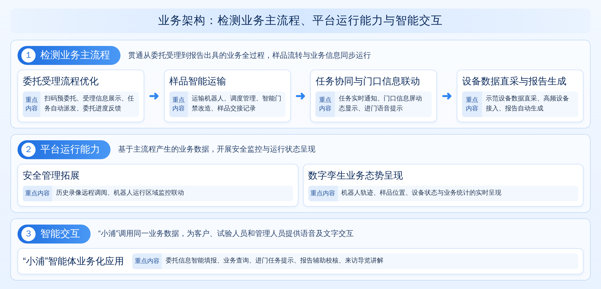
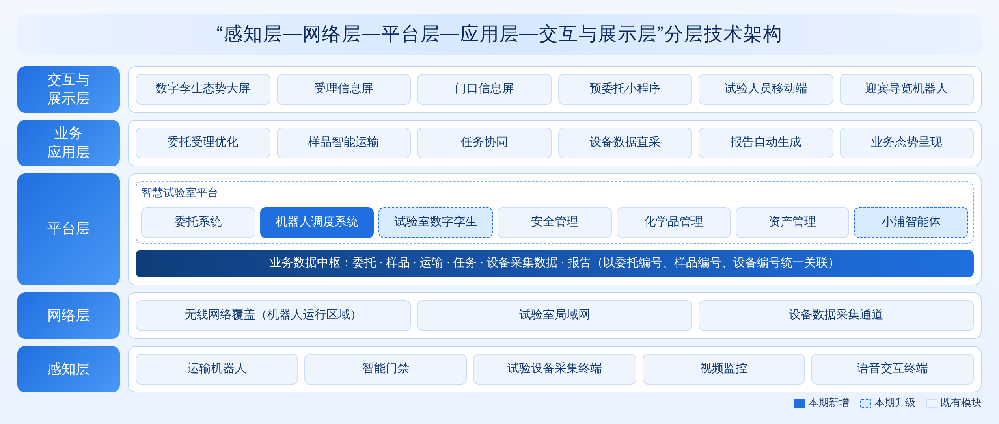
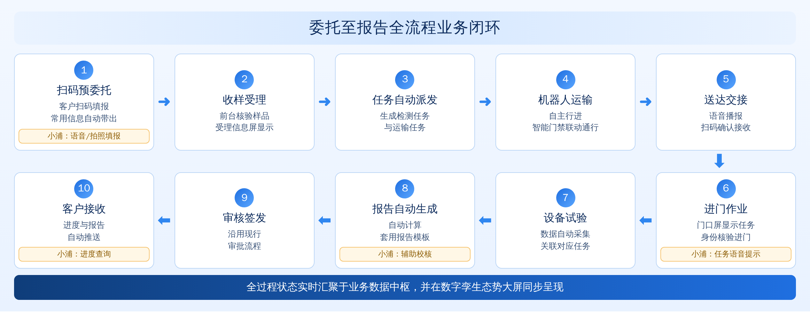

# 浦江网联试验室智能化提升项目（三期）建设方案

> 江苏正方交通科技有限公司
> 2026年10月

---

## 一、项目概述

### 1.1 项目背景

随着公路工程建设、运营养护及质量监管持续向数字化、智能化方向发展，试验检测机构的业务管理模式正由单一业务系统的信息化应用，逐步转向覆盖委托受理、样品流转、试验执行、数据采集与报告编制全过程的协同管理。各业务环节之间信息与实物的衔接效率，已成为影响检测服务质量与管理水平的重要因素。

浦江网联试验室前期已围绕试验室数字化与人工智能应用开展持续建设，建成智慧试验室平台，形成试验室数字孪生、委托系统、安全管理、化学品管理及资产管理等功能模块，部署门禁、门口信息屏与分场所视频监控，并上线智能语音助手“小浦”，为本期建设奠定了平台与数据基础。

在此基础上，本期建设以检测业务主流程为主线，通过引入样品运输机器人、实施智能门禁改造与设备数据直采，推动样品实物流转与业务信息流转的同步联动，构建从业务过程感知、数据追溯到运行状态展示的完整链条。与此同时，本期将业务流程运行中产生的实时数据接入试验室数字孪生与“小浦”：数字孪生由空间展示拓展为业务运行态势的呈现，“小浦”由知识问答助手升级为覆盖业务全过程的业务智能体。

本期建设旨在推动试验室由以系统支撑为主、局部环节联动的运行模式，转向全过程贯通、软硬件协同、进展实时查看与智能化交互的运行模式，形成兼顾日常业务应用与示范展示需求的智慧试验室应用体系。

### 1.2 项目现状

经过前期建设，试验室在以下方面已形成可供本期利用的基础：

**在平台建设方面**，已建成智慧试验室平台，集成试验室数字孪生、委托系统、安全管理、化学品管理与资产管理等功能模块。本期新增的机器人调度、业务数据汇聚等功能将在该平台内统一集成。

**在检测业务方面**，委托系统已覆盖委托登记、任务下达、数据录入至报告打印等主要环节，各检测项目已配置计算公式，并具备纸质原始记录智能识别与常规检测报告自动生成能力。本期重点优化委托受理流程，并打通设备数据与报告生成之间的自动衔接。

**在设备接入方面**，已完成部分试验设备的数据接入。本期以压力机为示范设备，进一步扩大设备数据直采范围。

**在安全与资产管理方面**，已具备分场所视频实时监控、化学品线上管理以及人员、设备等资产管理能力。本期拓展历史录像远程调阅，并将机器人运行区域纳入安全管理范围。

**在智能交互方面**，“小浦”已能够通过语音完成行业知识问答、检测任务信息查询和部分智能屏控制，并与烘箱、软化点仪、针入度仪、延度仪等设备实现初步联动。本期为“小浦”接入实时业务数据，扩展其业务查询与辅助操作能力。

### 1.3 建设目标

本期建设在继承前期成果的基础上，以全过程贯通、软硬件协同、进展实时查看和智能化交互为目标，具体包括以下五个方面。

**第一，构建委托至报告的全流程业务闭环。** 委托受理完成后，系统自动生成检测任务与样品运输任务；样品由机器人运送至试验室，试验数据经设备自动采集后生成报告，使一份委托从受理到报告出具的全过程实现联动运行与数据自动流转。

**第二，建设样品智能运输体系。** 配置样品运输机器人及调度系统，并对运输路线上的试验室门体实施智能门禁改造，实现样品在前台与各试验室之间的自主运输、自动通行和交接记录。

**第三，实现设备数据直采与报告自动生成。** 以压力机为示范设备开展数据直采，将试验数据与委托、样品及任务自动关联，并与既有计算公式和报告生成功能衔接，实现示范检测项目报告的自动生成。

**第四，拓展数字孪生的业务态势呈现能力。** 将实时业务数据接入试验室数字孪生，在三维模型中呈现机器人运行轨迹、样品位置、设备状态与业务统计信息，支持管理人员实时查看试验室运行进展。

**第五，推动“小浦”的业务化应用。** 为“小浦”接入委托、样品、任务、设备与报告等业务数据，使其能够在委托填报、任务提示、业务查询、报告校核与来访导览等场景中提供交互服务。

---

## 二、总体架构

### 2.1 业务架构

本项目的业务架构由检测业务主流程、平台运行能力和智能交互三部分构成（图2-1）。

| 组成部分 | 建设内容 | 作用 |
| --- | --- | --- |
| 检测业务主流程 | 委托受理流程优化；样品智能运输；任务协同与门口信息联动；设备数据直采与报告自动生成 | 贯通从委托受理到报告出具的业务全过程 |
| 平台运行能力 | 安全管理拓展；数字孪生业务态势呈现 | 为业务运行提供安全监控与运行状态呈现 |
| 智能交互 | “小浦”智能体业务化应用 | 为客户、试验人员和管理人员提供统一的语音及文字交互入口 |

三部分之间的关系如下：检测业务主流程在运行中产生委托、样品、任务、设备与报告等业务数据；平台运行能力基于这些数据开展安全监控与运行状态呈现；“小浦”调用同一数据，为不同角色的人员提供查询与辅助服务。

### 2.2 技术架构

项目技术架构按照感知层、网络层、平台层、应用层与交互展示层分层组织（图2-2）。

感知层由运输机器人、智能门禁、试验设备采集终端、视频监控与语音交互终端组成，负责实物运行与数据采集；网络层提供机器人运行区域的无线覆盖、试验室局域网与设备数据采集通道；平台层以智慧试验室平台为核心，在既有委托系统、安全管理、化学品管理、资产管理等模块的基础上，新增机器人调度系统，升级试验室数字孪生与“小浦”智能体，并建设业务数据中枢；应用层承载委托受理、样品运输、任务协同、设备数据直采、报告生成与业务态势呈现等业务应用；交互展示层面向客户、试验人员与管理人员提供多终端访问。

业务数据中枢汇聚委托、样品、运输、任务、设备采集数据与报告等业务数据，以委托编号、样品编号和设备编号为主键建立关联，统一向数字孪生、“小浦”及各业务应用提供数据服务。

### 2.3 业务流程

本期业务流程覆盖单份委托从客户提交到报告交付的全过程（图2-3）。各环节由上一环节自动触发，人员主要承担核验、确认与审核工作，环节之间的信息由系统自动传递。

---

## 三、建设内容

### 3.1 委托受理流程优化

委托业务继续在委托系统中办理。本期在不改变委托业务主体的前提下，围绕减少客户填报工作量、及时反馈受理结果以及自动触发后续环节三个方面优化受理流程，使委托受理成为整个业务流程的数据起点。

**（1）扫码预委托**

在前台设置预委托二维码，客户通过微信小程序填报委托单位、工程名称、检测项目、样品信息及联系人等内容。系统自动带出客户历史填报的单位、工程与联系人信息；客户也可通过“小浦”以语音描述或拍摄纸质委托单的方式，由系统识别并预填委托信息。

业务效益：客户可在到达前台前完成委托信息的结构化填报，前台人员据此开展受理，现场填写与反复核对的时间相应缩短。

**（2）受理信息展示**

前台人员核验样品与预委托信息后，在委托系统完成正式受理。受理完成后，受理信息屏显示委托编号、委托单位、检测项目与预计出具报告日期，系统同时向客户推送受理回执。

业务效益：客户在受理完成时即可获知检测项目与检测周期，委托服务的透明度得到提升。

**（3）任务自动派发**

正式受理完成后，系统自动生成检测任务与样品运输任务，检测任务推送至对应试验人员，运输任务推送至机器人调度系统。

业务效益：受理环节与后续检测、运输环节自动衔接，人工通知与任务转录的工作量相应减少，样品从受理到进入试验的等待时间缩短。

**（4）委托进度反馈**

检测过程中，系统通过小程序或短信向客户推送检测进度与报告出具通知；客户也可在小程序中向“小浦”查询委托进度、样品状态与预计出具报告时间。

业务效益：客户可主动获取委托进度，电话询问相应减少，客户服务体验得到改善。

**（5）委托流程交互原型**

在方案评审阶段同步交付委托受理流程的前端交互原型，呈现预委托、受理、派单与进度反馈的操作过程，用于流程确认与现场演示，确认后进入正式开发。

业务效益：建设内容在开发前即可得到直观确认，需求理解偏差得以降低，开发成果与实际业务需求的一致性得到保障。

### 3.2 样品智能运输

本期引入自主移动机器人（AMR），承担样品在前台与各试验室之间的运输，并配套调度系统与智能门禁改造，使样品运输由人工搬运转为机器人自主运输，运输过程与交接情况均有记录可查。

**（1）运输机器人配置**

配置样品运输机器人2台：潜伏顶升式机器人承担混凝土试块、钢筋等重样品的批量运输；升降带屏幕式机器人承担轻小样品运输，运行中通过屏幕显示所载样品与目的地，空闲时可搭载“小浦”承担来访导览。具体选型见3.8节。

业务效益：试验人员的样品搬运工作量得到减轻，样品运输过程可被现场直接观察。

**（2）机器人调度管理**

在智慧试验室平台中新增机器人调度系统，接收委托受理环节下发的运输任务，完成路径规划、任务分配、交通管理与自动充电管理，并实时回传机器人位置、任务状态与电量信息。

业务效益：运输任务由系统统一接收与调度，多台机器人可有序运行，同时为数字孪生提供实时运行数据。

**（3）智能门禁改造**

对运输路线上的试验室门体实施智能门禁改造，门禁具备开门、关门及开门到位信号输出，并与调度系统联动：机器人到达时门禁自动开启，通过后自动关闭；人员进出仍按既有门禁权限进行身份核验。

业务效益：机器人可自主通过各试验室门禁，运输过程无需人员开门等待。

**（4）样品交接记录**

样品装载时通过扫码绑定委托编号与样品编号；机器人到达目的地后语音播报并通知接收人员，接收人员扫码确认接收。交出、运输与接收记录分别保存，并与对应委托任务关联。

业务效益：样品的位置、交接人员与交接时间均可查询，样品错拿、漏送的风险相应降低。

**（5）运行异常处置**

当出现通道阻塞、无人接收、定位异常或电量偏低等情况时，机器人自动暂停并向相关人员告警，必要时转为人工处理；异常过程纳入运输记录，并可调取对应位置的监控画面。

业务效益：运输异常能够被及时发现并有序处置，样品运输安全与业务连续性得到保障。

### 3.3 任务协同与门口信息联动

本节将委托任务、样品送达信息与试验室门禁、门口信息屏进行联动，使试验人员能够及时获知任务，并在进入试验室时获得任务提示。

**（1）任务实时通知**

委托受理完成后，试验人员通过移动端接收任务信息，包括样品名称、检测项目、所在试验室与样品预计送达时间；样品送达时，系统再次提醒。

业务效益：试验人员无需逐项查询即可掌握当日任务，任务响应速度得到提升。

**（2）门口信息屏动态显示**

试验室门口信息屏的显示内容由任务数据自动生成，包括当前委托编号、样品名称、检测项目、责任试验人员与任务状态；试验人员经身份核验进入试验室，门禁记录与对应任务自动关联。

业务效益：门口信息与实际任务保持同步，人员进出记录与检测任务形成对应关系。

**（3）进门语音提示**

试验人员进入试验室后，“小浦”以语音方式提示当前任务、检测依据与样品数量；试验人员可通过语音询问任务详情、操作要点与相关规范条文。

业务效益：试验人员在现场即可获得任务与规范信息，翻查资料与切换系统的时间相应减少。

### 3.4 设备数据直采与报告自动生成

本节按照先示范、后推广的方式推进设备数据直采，并与既有计算公式和报告生成功能衔接，使试验数据由设备直接进入报告。采集数据纳入资产管理模块，并与设备台账关联。

**（1）示范设备数据直采**

选取压力机作为示范设备，完成数据采集改造。在不改变试验人员原有操作方式的前提下，自动采集试验原始值、试验曲线、采集时间与设备编号，并上传至业务数据中枢。

业务效益：示范设备的人工读数与抄录环节被取消，原始数据的真实性与完整性得到保障。

**（2）高频设备分批接入**

编制试验室仪器设备清单，按使用频率与数据输出条件分类，优先接入使用频率较高的设备；对需通过原厂软件导出文件的设备，建立文件读取方式。

业务效益：数据直采范围由示范设备逐步扩展至常用设备，自动采集覆盖率持续提高。

**（3）采集数据任务关联**

采集数据自动与委托、样品、任务、操作人员和设备建立关联，并写入委托系统对应的数据录入字段；无法匹配任务的数据进入待确认状态，由试验人员处理；对漏采、重复采集、单位不一致等情况进行提示并记录。

业务效益：设备数据与检测任务准确对应并自动录入，人工转填与核对工作量相应减少，检测数据追溯具备可靠来源。

**（4）示范项目报告自动生成**

以混凝土抗压强度检测作为示范项目。试验完成后，系统依据采集数据与既有计算公式完成计算，按现行报告模板生成报告初稿；报告经试验人员核对、审核人员审核后签发，并推送至客户。示范项目验证完成后，按同一方式扩展至其他检测项目。

业务效益：设备试验、数据采集与报告生成之间实现自动衔接，报告出具周期缩短，数据与报告的一致性得到提升。

### 3.5 安全管理拓展

本节在既有安全监控与预警管理功能的基础上，拓展管理人员远程调阅与机器人运行区域监控能力。

**（1）历史录像远程调阅**

通过远程访问方式，管理人员可在办公终端调阅硬盘录像机中的分场所历史录像；平台内回放功能结合存储资源需求另行评估。

业务效益：管理人员在办公室即可查看分场所实时画面与历史录像，安全管理的响应效率得到提升。

**（2）机器人运行区域监控联动**

将机器人运行路线纳入视频监控范围；发生运输异常或安全告警时，系统调取对应位置的监控画面，并在数字孪生中定位显示。

业务效益：运输过程与安全监控形成联动，现场情况能够被及时掌握和处置。

### 3.6 数字孪生业务态势呈现

本节在现有试验室全景与楼层三维孪生模型的基础上，接入业务数据中枢的实时数据，使数字孪生由空间展示拓展为业务运行态势的呈现。

**（1）机器人与样品实时追踪**

在楼层模型中实时显示运输机器人的位置、行进路线、任务与电量；选中某一委托后，模型中显示对应样品的当前位置与流转路径。

业务效益：样品流转过程得以直观呈现，管理人员与来访人员可以清楚了解业务流程的实际运行情况。

**（2）设备运行状态呈现**

试验设备在模型中以不同颜色标识空闲、试验中与故障状态，选中设备后可查看实时试验数据与使用记录；各试验室当前任务数量与人员在岗情况同步显示。

业务效益：管理人员可集中掌握设备与试验室的运行状态，为任务安排与资源调配提供依据。

**（3）业务统计与告警联动**

大屏显示当日委托数量、在检样品数量与待出报告数量等统计指标；安全告警与运输异常在模型中定位显示，并联动视频画面。数字孪生大屏同时作为“小浦”的语音交互终端，管理人员可通过语音查询业务数据，查询结果在模型中同步显示。

业务效益：业务统计、异常告警与语音查询集中于同一界面，为管理决策和对外展示提供统一窗口。

### 3.7 “小浦”智能体业务化应用

“小浦”已具备知识问答与语音交互能力。本期业务流程投入运行后，委托、样品、运输、任务、设备数据与报告等实时数据统一汇聚于业务数据中枢。本期通过为“小浦”接入业务数据查询与业务操作能力，使其由知识问答助手升级为覆盖业务全过程的业务智能体。

**（1）业务数据接入**

通过业务数据中枢为“小浦”提供结构化业务数据查询能力，查询范围按用户角色进行权限控制；将预委托填报、运输任务发起与报告校核等业务操作封装为智能体可调用的工具，关键操作须经人员确认后执行。

业务效益：“小浦”能够答复业务查询并辅助业务操作，同时数据安全与操作可控性得到保障。

**（2）委托信息智能填报**

客户可通过语音描述委托需求或拍摄纸质委托单，由“小浦”识别并预填委托信息，客户确认后提交。

业务效益：客户填报委托信息的工作量进一步减少。

**（3）业务查询**

客户可查询委托受理状态、检测进度与预计出具报告时间；试验人员可查询样品位置、当前任务与操作要点；管理人员可通过语音查询当日委托、在检样品、设备状态与报告出具等统计数据，查询结果在数字孪生大屏同步显示。

业务效益：不同角色的人员可通过自然语言获取所需业务信息，逐个系统查询与人工汇总的工作量相应减少。

**（4）报告辅助校核**

“小浦”对系统生成的报告初稿进行辅助校核，内容包括采集数据与报告数据的一致性比对、计算结果复核以及检测结果与标准限值的符合性提示，校核意见供试验人员与审核人员参考。

业务效益：报告初稿中的数据不一致与结果不符合项能够在审核前被发现，报告质量得到提升。

**（5）来访导览讲解**

“小浦”搭载于升降带屏幕式机器人，按预设路线引导来访人员参观试验室，并结合各区域功能进行讲解。

业务效益：参观接待过程得以规范化，本期软硬件协同的建设成果能够得到集中展示。

### 3.8 样品运输机器人选型

运输机器人是样品智能运输的核心硬件。本节结合试验室样品特性、场地条件与展示需求，对主流技术路线进行比选，并提出选型建议。

#### 3.8.1 选型依据

| 选型因素 | 考虑要点 |
| --- | --- |
| 样品特性 | 样品类型、单件重量、单批数量、包装方式（如混凝土试块、钢筋、土样、沥青混合料等） |
| 场地条件 | 通道宽度、转弯半径、地面平整度、坡度、门槛高度、是否跨楼层 |
| 交接方式 | 人工装卸、料箱插取或整体顶升 |
| 交互能力 | 是否需要屏幕显示、语音播报、智能体搭载等人机交互功能 |
| 联动能力 | 与智能门禁、电梯及智慧试验室平台的对接能力 |
| 展示效果 | 运行过程的直观性与现场观感 |

#### 3.8.2 技术路线比选

| 机型类别 | 工作方式 | 额定载荷 | 优势 | 适用条件 | 适用样品 |
| --- | --- | --- | --- | --- | --- |
| 潜伏顶升式 | 潜入货架或托盘底部顶升后整体运输 | 400 kg至1 t以上（多档可选） | 载荷大，可整架批量运输，技术成熟 | 需配套专用货架，装卸由人工完成 | 混凝土试块、钢筋等重样品 |
| 潜伏插取式 | 伸缩臂从货架插取料箱后运输 | 中等 | 可自动取放料箱，减少人工装卸 | 需标准化货架与料箱 | 标准料箱包装的中小样品 |
| 牵引式 | 自动挂钩牵引带轮料车运输 | 较大 | 可利用带轮料车，改造量小 | 转弯半径大，通道需较宽 | 通道宽敞、样品量大的场景 |
| 升降带屏幕式 | 自带升降料仓与交互屏幕 | 约40～50 kg级 | 具备屏幕显示与语音交互，可搭载“小浦”，适合人机混行 | 载荷相对较小 | 轻小样品运输及来访导览 |

【参考图：潜伏顶升式运输机器人（待补充）】

【参考图：潜伏插取式运输机器人（待补充）】

【参考图：牵引式运输机器人（待补充）】

【参考图：升降带屏幕式运输机器人（待补充）】

#### 3.8.3 选型建议

综合样品特性、场地条件与展示需求，建议配置潜伏顶升式与升降带屏幕式机器人各1台，分别承担重样品与轻小样品的运输，两台机器人由同一调度系统统一管理。最终机型与载荷参数在现场勘查及样品统计完成后确定。

| 配置 | 数量 | 承担任务 |
| --- | --- | --- |
| 潜伏顶升式机器人 | 1台 | 承担混凝土试块、钢筋等重样品的批量运输，配套带轮货架或托盘 |
| 升降带屏幕式机器人 | 1台 | 承担轻小样品运输，运行中通过屏幕显示所载样品与目的地；空闲时搭载“小浦”承担来访导览与讲解 |

#### 3.8.4 智能门禁通行方案

| 方案 | 方式 | 特点 |
| --- | --- | --- |
| 方案一 | 语音提示、人工开门 | 机器人到达门口后语音播报“样品送达”，由人员开门；改造量小 |
| 方案二 | 智能门禁联动开启 | 门禁接收调度指令或感应机器人后自动开启，运输过程无需人员干预 |

建议示范路线采用方案二。门禁须具备开门、关门及开门到位信号输出，并提供AC 220 V或DC 12 V电源。

【参考图：智能门禁联动示意（待补充）】

#### 3.8.5 场地与环境要求

依据GB/T 20721—2006《自动导引车 通用技术条件》及供应商技术要求，机器人运行场地须满足以下条件：

| 项目 | 要求 |
| --- | --- |
| 地面起伏 | 1 m²范围内不大于3 mm，地面整洁、防滑 |
| 路面坡度 | 不大于5%；精确停车点不大于1% |
| 台阶高度 | 不大于5 mm，停车位置不得有台阶 |
| 沟槽宽度 | 不大于8 mm，停车位置不得有沟槽 |
| 环境条件 | 温度0～45 ℃，湿度15%～95%（无结露），无粉尘及腐蚀性气体 |
| 无线网络 | 运行区域信号强度不低于-65 dBm，采用1、6、11信道 |
| 充电桩 | 单回路功率不低于2000 W，独立配置16 A空气开关 |

---

## 四、示范应用场景

本期建设成果通过以下示范场景集中呈现。该场景基于真实委托与真实数据运行，与试验人员的日常作业流程一致，可同时用于日常业务、上级考察与客户参观。

| 步骤 | 场景位置 | 业务动作 | 呈现效果 |
| --- | --- | --- | --- |
| 0 | 前台 | 来访人员到达 | 导览机器人搭载“小浦”引导参观，介绍试验室概况 |
| 1 | 前台 | 客户扫码或向“小浦”语音描述，完成预委托 | 受理信息屏显示新委托 |
| 2 | 前台 | 前台人员核验并受理，样品装载 | 机器人屏幕显示所载样品与目的地，自动出发 |
| 3 | 运输通道 | 机器人自主行进 | 智能门禁自动开启，机器人自主通行 |
| 4 | 数字孪生大屏 | 任务同步派发 | 三维模型显示机器人轨迹、样品位置与试验人员接单情况 |
| 5 | 试验室门口 | 试验人员接收样品并进入试验室 | 门口信息屏显示当前任务，“小浦”语音提示检测项目与依据 |
| 6 | 力学试验室 | 压力机开展试验 | 试验数据实时采集，设备在孪生模型中显示为“试验中” |
| 7 | 数字孪生大屏 | 试验完成 | 报告初稿自动生成，“小浦”完成辅助校核并提示结果 |
| 8 | 数字孪生大屏 | 管理人员语音询问当日委托情况 | “小浦”语音答复，统计数据在大屏同步显示 |

---

## 五、项目计划与预期成果

### 5.1 工作安排

项目整体按约16周规划，划分为六个阶段。

| 阶段 | 周期 | 主要工作 | 阶段成果 |
| --- | --- | --- | --- |
| 第一阶段：基础优化 | 第1—4周 | 委托数据联动、门口信息屏动态显示、历史录像远程调阅、建设内容确认 | 平台可获取实时委托数据；建设内容确认单 |
| 第二阶段：示范采集 | 第1—2周（并行） | 压力机数据采集改造与联调 | 示范设备数据自动上传 |
| 第三阶段：设计与采购 | 第3—6周 | 现场勘查、机器人选型与采购、智能门禁改造、信息屏安装、委托流程交互原型评审与开发 | 硬件到场，原型确认 |
| 第四阶段：系统联调 | 第7—10周 | 委托、运输、通知、试验、报告全流程联调；数字孪生数据接入 | 示范场景完整运行 |
| 第五阶段：智能体升级 | 第7—12周（并行） | “小浦”业务数据接入、业务工具封装、多终端部署 | “小浦”支持业务查询与辅助操作 |
| 第六阶段：试运行与验收 | 第13—16周 | 日常业务试运行、优化调整、示范场景演练、成果整理与验收 | 试运行报告、验收材料 |

### 5.2 预期成果

| 成果类别 | 交付成果 | 主要内容 |
| --- | --- | --- |
| 业务应用成果 | 检测业务全流程应用 | 委托受理流程优化、样品智能运输、任务协同与门口信息联动、设备数据直采与报告自动生成 |
| 硬件设施成果 | 试验室智能硬件 | 样品运输机器人2台及调度系统、智能门禁、受理信息屏与门口信息屏、设备数据采集终端 |
| 智能应用成果 | “小浦”业务智能体 | 接入实时业务数据，支持委托填报、业务查询、任务提示、报告校核与来访导览 |
| 智能应用成果 | 数字孪生态势大屏 | 实时呈现机器人轨迹、样品位置、设备状态、业务统计与告警信息 |
| 示范场景成果 | 全流程示范场景 | 基于真实委托运行的委托至报告全流程示范 |
| 文档成果 | 项目建设及交付文档 | 需求分析、总体设计、接口及数据说明、部署说明、操作手册、测试报告、试运行报告、培训材料与验收材料 |

### 5.3 验收指标

| 序号 | 验收指标 |
| --- | --- |
| 1 | 以真实样品连续3次完整运行示范应用场景全部步骤，过程中无需人工补录数据 |
| 2 | 受理完成后1分钟内，试验人员收到任务通知，门口信息屏同步更新 |
| 3 | 试运行期间，首条示范路线的运输送达成功率不低于95% |
| 4 | 示范设备试验数据100%自动采集并关联至正确任务 |
| 5 | 示范检测项目报告由系统自动生成初稿，并由“小浦”完成辅助校核 |
| 6 | 数字孪生实时显示机器人位置、样品位置与设备状态 |
| 7 | “小浦”能够正确回答委托进度、样品位置、设备状态与当日统计等业务查询 |
| 8 | 管理人员可在办公终端调阅分场所历史录像 |

### 5.4 组织保障

| 角色 | 主要职责 |
| --- | --- |
| 建设单位 | 建设需求确认、内部协调、采购审批、示范场地与人员配合，提供委托表单与报告模板 |
| 实施单位（江苏正方交通科技有限公司） | 方案设计、软件开发、系统联调、硬件集成、智能体升级、培训与运维 |
| 委托系统服务方 | 配合委托数据同步 |
| 机器人供应商 | 设备供货、现场部署，以及调度系统与智慧试验室平台的对接 |

---

## 六、后续演进规划

试验室智能化建设按照先贯通业务流程、再深化智能应用的顺序推进。在本期业务流程稳定运行的基础上，后续可围绕以下方向持续深化，并结合运行情况另行立项论证。

| 方向 | 建设内容 | 前置条件 |
| --- | --- | --- |
| 知识库体系化建设 | 系统整理标准规范、试验方法、质量体系文件、报告模板、典型案例与项目成果，构建企业知识资产体系，提升“小浦”的专业能力 | 业务数据持续积累 |
| 试块龄期智能提醒 | 依据试块成型日期与养护规则，自动提醒混凝土试块到龄期，替代人工台账管理 | 委托与样品数据贯通 |
| 异常预警与质量管控 | 对数据异常、设备与环境异常、进度异常及检测结果异常进行自动识别与预警，并记录处置过程 | 设备数据直采覆盖率提高 |
| 专项报告智能编制 | 以桥梁定期检查报告为试点，集成现有桥检报告软件，逐步实现复杂报告的智能编制 | 常规报告自动生成机制成熟 |
| 设备全面接入 | 按仪器设备清单分批完成剩余设备的数据直采接入 | 示范与高频设备接入完成 |
| 业务流程智能化优化 | 由专业实施人员驻场，结合人工智能能力对检测业务流程进行系统性优化 | 业务流程运行稳定，数据基础完备 |
